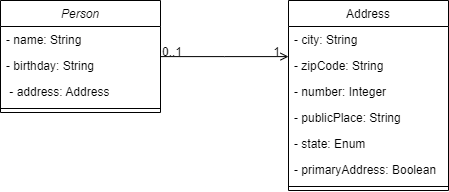
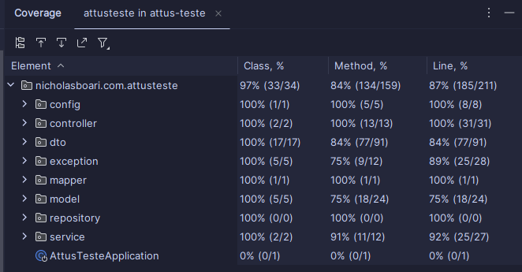
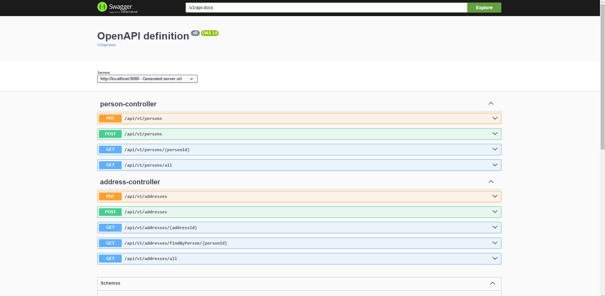

# Attus Gerenciamento de Pessoas

## Diagrama UML



## Tecnologias Utilizadas

- Java 17
- Spring Boot 3.2.5
- Spring Data
- Dockerfile
- Docker Compose
- Swagger
- H2 Database

## Instalação

1. Clone o repositório:

   ```bash
   git clone git@github.com:nicholasboari/attus-teste.git
   
2. Entre no diretório do projeto:
    ```bash
   cd attus-teste
   
3. Inicie com Docker Compose
   ```bash
   docker compose up

Obs: O projeto é executado na porta 8080.
## Cobertura de Testes


## Documentação



# Autor

**Nome do Autor:** Nicholas Boari

**Contato:**
- E-mail: nicholasboari@gmail.com
- LinkedIn: https://www.linkedin.com/in/nicholasboari/
- GitHub: https://github.com/nicholasboari